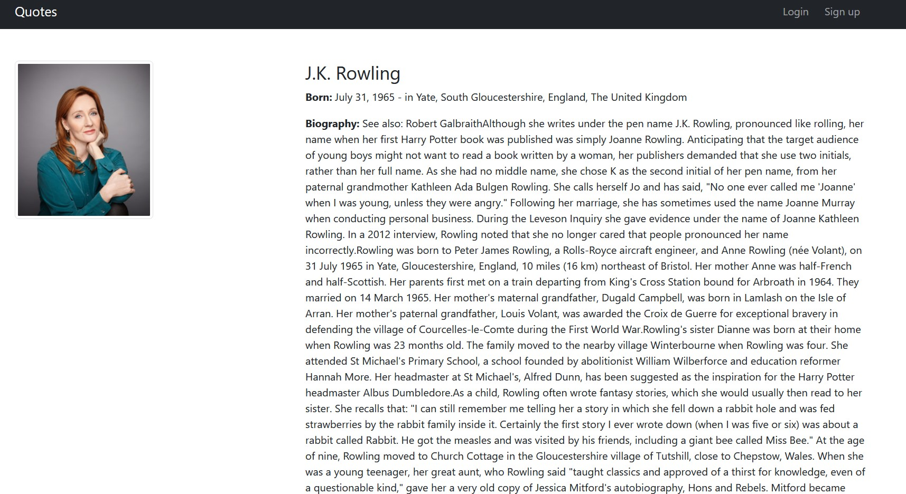

# GoIT_WEB_HW_10
Individual homework №10 at GoIT school - copy of website [**`quotes.toscrape.com`**](http://quotes.toscrape.com/).

<div>
  <a href="https://www.python.org" target="_blank">
    
  </a>
  &nbsp;&nbsp;&nbsp;&nbsp;
  <a href="https://www.djangoproject.com" target="_blank">
    
  </a>
  &nbsp;&nbsp;&nbsp;&nbsp;
  <a href="https://www.postgresql.org" target="_blank">
    
  </a>
  &nbsp;&nbsp;&nbsp;&nbsp;
  <a href="https://www.mongodb.com" target="_blank">
    
  </a>
  &nbsp;&nbsp;&nbsp;&nbsp;
  <a href="https://getbootstrap.com" target="_blank">
    
  </a>
  &nbsp;&nbsp;&nbsp;&nbsp;
  <a href="https://www.w3.org/html" target="_blank">
    
  </a>
</div>


## Description 

In the course of completing the individual work, tasks such as: 

• registering on the site and logging in to the site;

• adding a new author to the site, only for a registered user;

• being able to add a new quote to the site, with author, for a registered user only;

• migration of database from MongoDB to Postgres;

• without user authentication it is possible to view citations and information about all authors;

• search for quotes by tags - when clicking on a tag, the list of quotes with this tag is displayed;

• implemented "Top Ten tags" block and output the most popular tags;

• pagination is implemented.


## Running the program

Before we start, we should make sure we have a **`MongoDB`** database with the authors and quotes collections already created. You can find information about connecting to MongoDB in individual activity №9. Parsing the site and saving the data to MongoDB was done in [individual work #9](https://github.com/S-Stepanov-1/GoIT_WEB_HW_9.git). This is necessary for filling the site with data. But you can do without it. In this case the site will be empty, but you will still be able to add authors and quotes to it.
### MongoDB


**Now you need to follow the steps below:**

• Clone this repository to your computer. To do this, run a command prompt and type
```
git clone https://github.com/S-Stepanov-1/GoIT_WEB_HW_10.git
```
• Then you need to install the dependencies:
```
poetry install
```
The site is configured to work with a Postgres database. Therefore, you will also need access to this database. This can be done, for example, by running a **`Docker container`**: 
```
docker run --name container_name -p 5432:5432 -e POSTGRES_PASSWORD=your_secret_password_here -d postgres.
```

Instead of `container_name` and `your_secret_password_here`, you need to specify the name of the container and its password, respectively. 
After that you need to create a `config.ini` file in the project folder. This file should have the following path `hw_10_website/config.ini` In this file specify passwords for access to the database and the name of the database. (see the photo below).

### config.ini


### **`Note that you must run all of the following commands in the console from the hw_10_website folder`**


• You can now perform the migrations. This will create tables in your PostgreSQL database:
```
python manage.py migrate
```

• If you have a MongoDB database with data, you can migrate all your data to PostgreSQL. To do this, run the following command:
```
python -m  utils.custom_migration 
```

• Now you can start the server and access the site at 127.0.0.1:8000
```
python manage.py runserver
```

### Website


### Author's profile

